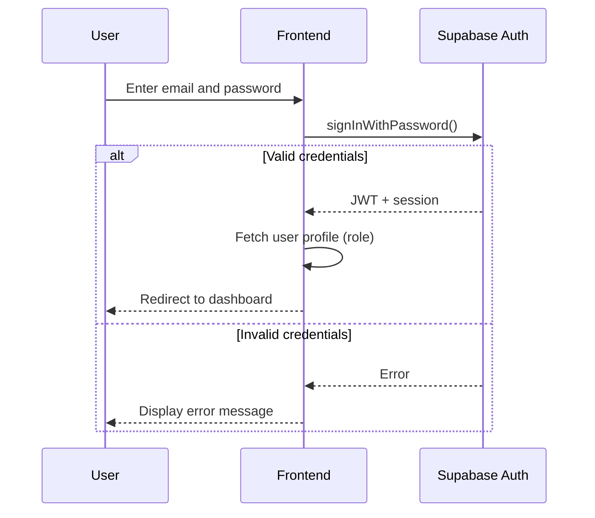
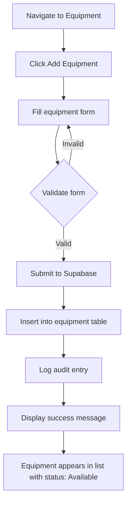
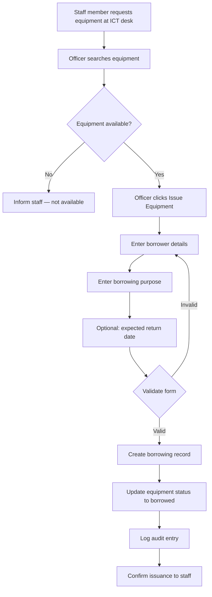
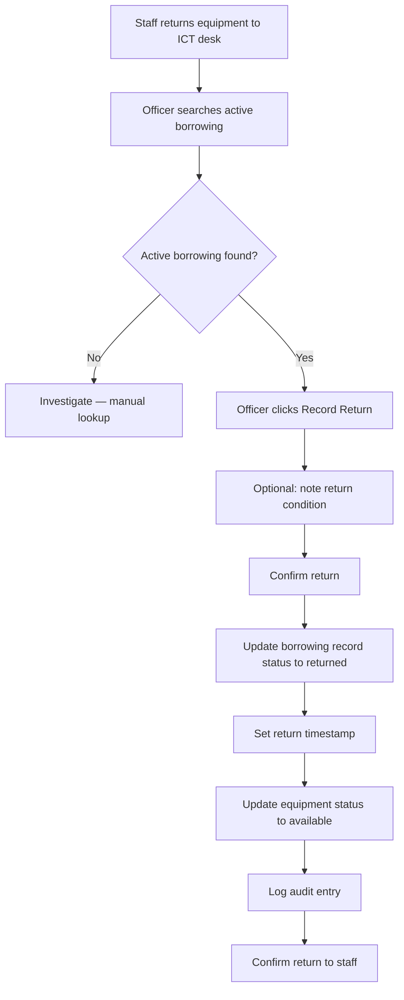
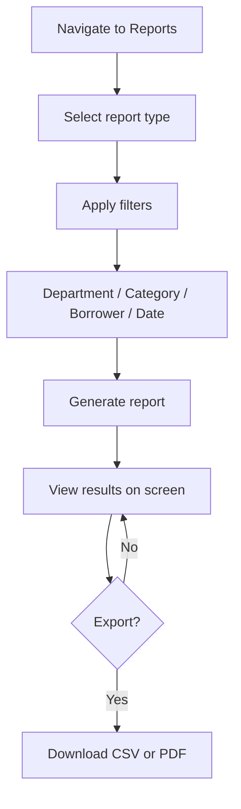
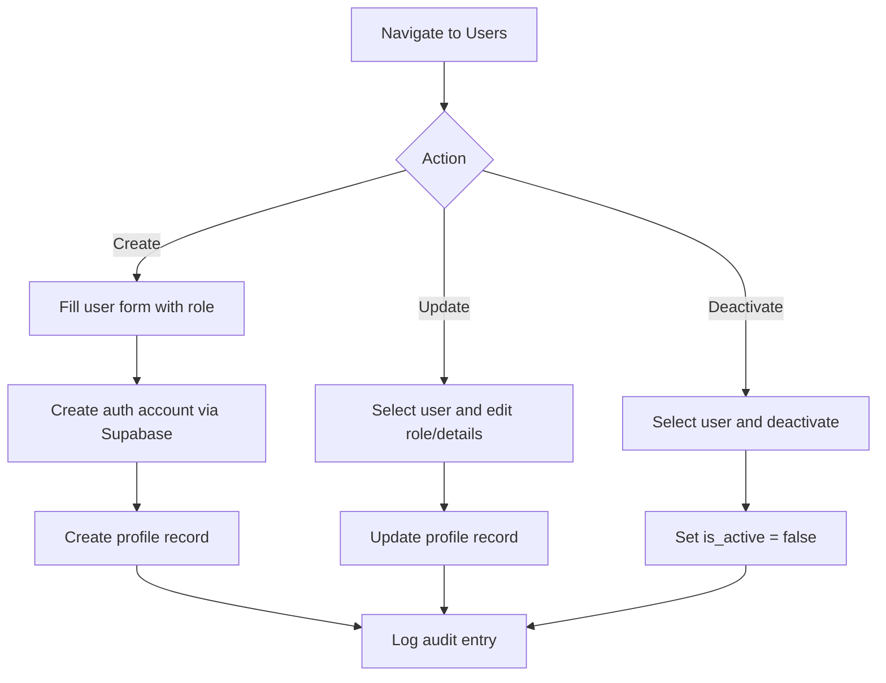
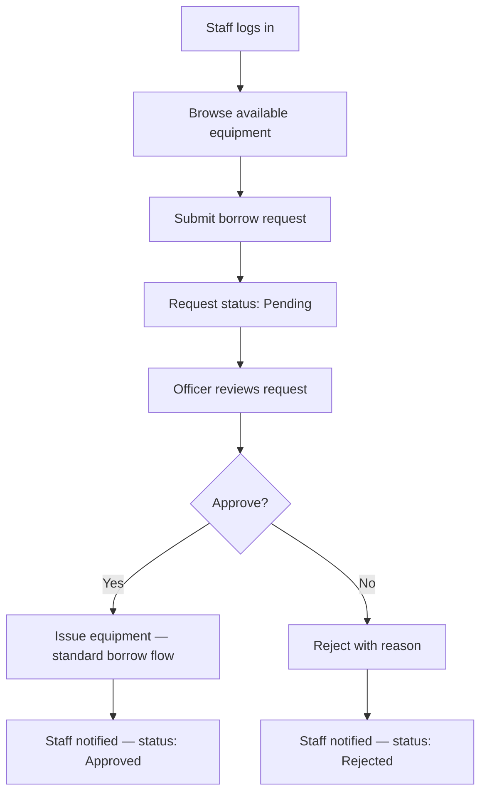

# System Workflow

## Document Information

| Field | Detail |
|-------|--------|
| **Project Name** | AssetFlow |
| **Version** | 1.0 |
| **Status** | Draft |
| **Last Updated** | June 2026 |

---

## 1. Introduction

This document describes the business process flows for AssetFlow. Each workflow maps the steps performed by users, the system actions triggered, and the data changes that occur in the Supabase database.

---

## 2. High-Level System Flow

```text
┌──────────┐     ┌──────────────┐     ┌─────────────┐     ┌──────────────┐
│  Login   │────▶│  Dashboard   │────▶│  Operations │────▶│   Reports    │
│ (Auth)   │     │  (Home)      │     │  (CRUD)     │     │  (Export)    │
└──────────┘     └──────────────┘     └─────────────┘     └──────────────┘
```

After authentication, users land on a role-appropriate dashboard and navigate to the modules permitted for their role.

---

## 3. Authentication Workflow

### 3.1 Login



### 3.2 Steps

1. User navigates to the login page.
2. User enters email and password.
3. Frontend calls Supabase Auth `signInWithPassword`.
4. On success, frontend retrieves the user's profile (including role) from the `profiles` table.
5. User is redirected to the dashboard.
6. On failure, an error message is displayed.

### 3.3 Logout

1. User clicks Logout.
2. Frontend calls Supabase Auth `signOut`.
3. Session and JWT are cleared.
4. User is redirected to the login page.

---

## 4. Equipment Registration Workflow

**Performed by:** ICT Administrator



### Steps

1. Administrator navigates to the Equipment module.
2. Clicks "Add Equipment".
3. Fills in: name, category, serial number, asset tag, condition, and optional notes.
4. System validates required fields and unique constraints (serial number, asset tag).
5. Record is inserted into the `equipment` table with status `available`.
6. An audit log entry is created.
7. Equipment appears in the inventory list.

---

## 5. Equipment Borrowing Workflow

**Performed by:** ICT Officer or ICT Administrator

This is the core operational workflow replacing the manual logbook entry.



### Steps

1. Staff member visits the ICT desk and requests equipment.
2. Officer searches for the equipment in the system.
3. System displays equipment details and current status.
4. If status is not `available`, officer informs the staff member.
5. If available, officer clicks "Issue Equipment".
6. Officer enters borrower information:
   - Full name
   - Department
   - Employee ID (optional)
   - Contact number (optional)
7. Officer enters the purpose of borrowing.
8. Officer optionally sets an expected return date.
9. System validates the form and creates a record in `borrowing_records` with status `active`.
10. System updates the equipment status to `borrowed`.
11. System logs the action in `audit_logs`.
12. Officer confirms issuance to the staff member.

### Data Changes

| Table | Action |
|-------|--------|
| `borrowing_records` | INSERT new record (status: `active`) |
| `equipment` | UPDATE status → `borrowed` |
| `audit_logs` | INSERT action: `equipment_issued` |

---

## 6. Equipment Return Workflow

**Performed by:** ICT Officer or ICT Administrator



### Steps

1. Staff member returns equipment to the ICT desk.
2. Officer searches for the active borrowing record (by borrower name, equipment, or department).
3. System displays the active borrowing details.
4. Officer clicks "Record Return".
5. Officer optionally notes the condition of the returned equipment.
6. Officer confirms the return.
7. System updates the borrowing record: status → `returned`, `returned_at` → current timestamp.
8. System updates equipment status → `available`.
9. System logs the action in `audit_logs`.
10. Officer confirms return to the staff member.

### Data Changes

| Table | Action |
|-------|--------|
| `borrowing_records` | UPDATE status → `returned`, set `returned_at` |
| `equipment` | UPDATE status → `available` |
| `audit_logs` | INSERT action: `equipment_returned` |

---

## 7. Equipment Status Lifecycle

```text
                    ┌──────────────┐
         Register   │              │
        ──────────▶ │  AVAILABLE   │◀──────────┐
                    │              │           │
                    └──────┬───────┘           │
                           │ Issue             │ Return
                           ▼                   │
                    ┌──────────────┐           │
                    │              │           │
                    │   BORROWED   │───────────┘
                    │              │
                    └──────────────┘

        Admin actions (manual):
        AVAILABLE ◀──▶ UNDER MAINTENANCE
        AVAILABLE ──▶ RETIRED (permanent)
```

| Status | Meaning | Transitions |
|--------|---------|-------------|
| `available` | Ready to be borrowed | → `borrowed` (on issue), → `under_maintenance` (admin), → `retired` (admin) |
| `borrowed` | Currently issued to a borrower | → `available` (on return) |
| `under_maintenance` | Temporarily unavailable for repair | → `available` (admin) |
| `retired` | Permanently removed from active inventory | Terminal state |

---

## 8. Reporting Workflow

**Performed by:** ICT Officer or ICT Administrator



### Available Reports

| Report | Description |
|--------|-------------|
| **Borrowing History** | All borrowing transactions with filters |
| **Currently Borrowed** | Active borrowings not yet returned |
| **Equipment Inventory** | Full equipment list with status |
| **Overdue Items** | Borrowings past expected return date |

### Filter Options

- Department
- Equipment category
- Borrower name
- Date range (borrowed from / to)
- Equipment status

---

## 9. User Management Workflow

**Performed by:** ICT Administrator only



### Create User Steps

1. Administrator navigates to User Management.
2. Clicks "Add User".
3. Enters: full name, email, role (`admin` or `officer`), and department.
4. System creates the user in Supabase Auth.
5. System creates a corresponding `profiles` record.
6. Administrator communicates login credentials to the new user securely.

---

## 10. Audit Trail Workflow

Audit logging is automatic and occurs as a side effect of significant actions:

| Trigger Action | Audit Log Entry |
|----------------|-----------------|
| User login | `user_login` |
| Equipment registered | `equipment_created` |
| Equipment updated | `equipment_updated` |
| Equipment issued | `equipment_issued` |
| Equipment returned | `equipment_returned` |
| User created | `user_created` |
| User role changed | `user_role_updated` |
| User deactivated | `user_deactivated` |
| Report exported | `report_exported` |

Audit entries are written via database triggers or application logic and are read-only for all users.

---

## 11. Error Handling Flows

### 11.1 Attempt to Issue Unavailable Equipment

1. Officer selects equipment with status other than `available`.
2. System disables the "Issue" action or displays a warning.
3. Officer is informed the equipment cannot be issued.

### 11.2 Attempt to Return Non-Borrowed Equipment

1. Officer searches for equipment with no active borrowing record.
2. System displays "No active borrowing found."
3. Officer investigates manually or contacts administrator.

### 11.3 Session Expiry

1. JWT token expires during an active session.
2. Frontend detects expired session on next API call.
3. User is redirected to login with a "Session expired" message.

---

## 12. Future Workflow: Staff Self-Service (Planned)



---

## 13. Related Documentation

| Document | Description |
|----------|-------------|
| [User-Roles.md](./User-Roles.md) | Role permissions for each workflow |
| [Database-Design.md](./Database-Design.md) | Tables affected by each workflow |
| [API-Documentation.md](./API-Documentation.md) | API calls for each workflow |
| [User-Manual.md](./User-Manual.md) | Step-by-step user instructions |
